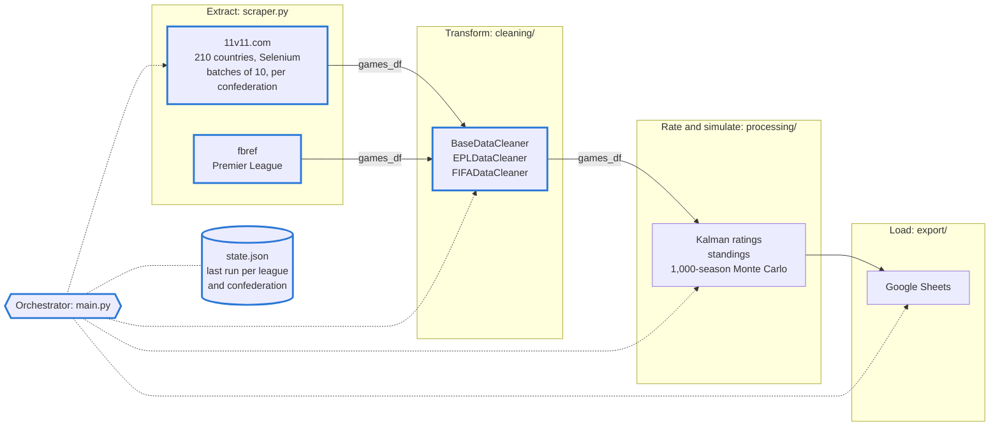
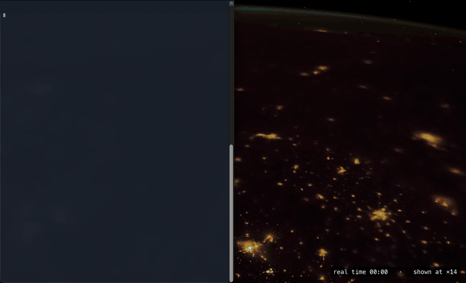
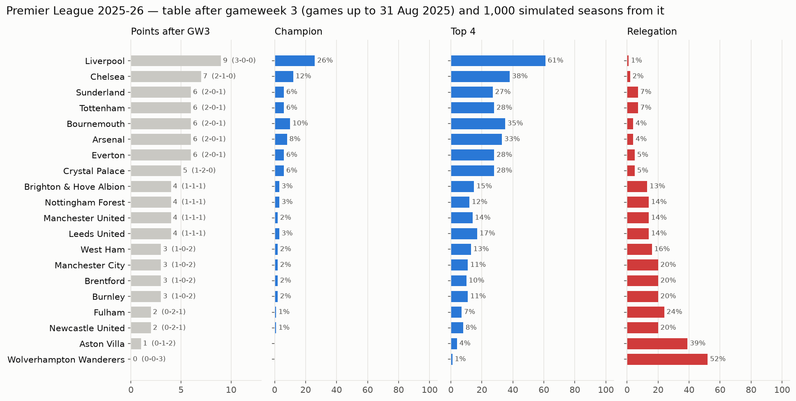
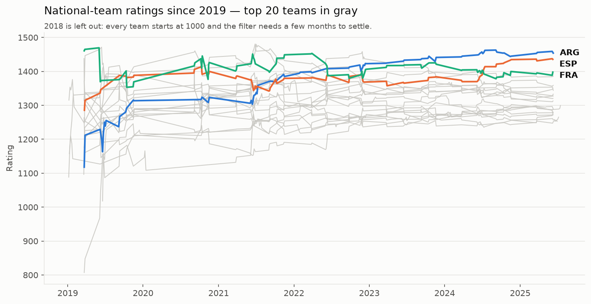

<p align="center">
  
  &nbsp;&nbsp;&nbsp;&nbsp;
  <picture><source media="(prefers-color-scheme: dark)" srcset="assets/logos/inrs_dark.png"></picture>
  &nbsp;&nbsp;&nbsp;&nbsp;
  <picture><source media="(prefers-color-scheme: dark)" srcset="assets/logos/mitacs_dark.png"></picture>
  &nbsp;&nbsp;&nbsp;&nbsp;
  <picture><source media="(prefers-color-scheme: dark)" srcset="assets/logos/epl_dark.png"></picture>
  &nbsp;&nbsp;&nbsp;&nbsp;
  <picture><source media="(prefers-color-scheme: dark)" srcset="assets/logos/fifa_dark.png"></picture>
</p>

# BrBaLab sports-rating pipeline · summer 2025

**A staged batch ETL pipeline that scrapes football results from 210 countries and the Premier League, cleans them, and feeds a
Kalman-filter rating model and season forecasts.** I built it in 2025 at INRS-EMT (Montréal) as a Mitacs Globalink research intern.
This repo replays that 2025 code offline, in one notebook.

[](https://colab.research.google.com/github/cortezxm/brbalab-cortez/blob/main/brbalab_pipeline.ipynb)

## The pipeline



<sub>Blue outline: the parts I built. The rating/simulation and export layers were built by my teammate on the same contract.</sub>

<p align="center">
  
</p>

<sub>The 2025 FIFA scraper running live on 11v11.com (Mexico, 19 matches, 3 min 15 s real time, shown at ×14).
Full recordings: <a href="assets/fifa_scraper.mp4">FIFA scraper, ×8</a> ·
<a href="assets/epl_scraper.mp4">EPL scraper</a>. fbref now blocks automated browsers, so the EPL recording runs on the Internet Archive copy of the page from 13 Sep 2025.</sub>

## What it produces

<picture>
  <source media="(prefers-color-scheme: dark)" srcset="assets/epl_season_simulation_dark.png">
  
</picture>

<picture>
  <source media="(prefers-color-scheme: dark)" srcset="assets/fifa_ratings_dark.png">
  
</picture>

Both figures are regenerated by the notebook from the 9 September 2025 data snapshot.

## What I built

- **Staged pipeline and orchestrator** (`backend/main.py`). One class runs extract → transform → rate → load and hands a single
  `games_df` between stages. Each stage can be re-run on its own and reports its own counts and timing.
- **Run state** (`acquisition/state.json`). The last successful run is stored per league and per FIFA confederation, so the six
  confederations run and fail independently, and a scheduler can't repeat work already done.
- **Resilient scraping** (`acquisition/scraper.py`). Batches of 10 countries, Chrome processes killed between batches, and pauses
  between countries, because long Selenium runs hung and the site throttled.
- **Cleaning layer** (`cleaning/`). A base class for shared validation, backup and rollback, and an audit trail of every removed row,
  with one subclass per source. On the FIFA data it removes 39 of 6,916 rows, including 35 mirrored duplicates.

## Numbers you can check

| | Value | Source |
|---|---|---|
| Countries in the FIFA scraper | 210 (21 batches) | computed from `scraper.py` in the notebook |
| Scrape time, CONMEBOL (10 countries) | 51–80 min per run, 5 runs | `backend/run_log.txt`, parsed in the notebook |
| FIFA rows cleaned | 6,916 → 6,877 | re-run in the notebook |
| Full FIFA scrape | ≈ 14 h | my own measurement, August 2025, not in the log |

## Run it

Click **Open in Colab** above, or run it locally:

```bash
git clone https://github.com/cortezxm/brbalab-cortez.git && cd brbalab-cortez
pip install -r requirements.txt jupyter
jupyter lab brbalab_pipeline.ipynb
```

Once cloned, everything runs offline in about 30 seconds. The notebook works on a temporary copy of `backend/`, so the repo stays untouched.

## Team and credits

Built at **BrBaLab, INRS-EMT** (Montréal), under the supervision of **Prof. Leszek Szczecinski**, through a **Mitacs Globalink Research
Internship** (May–August 2025). The rating model follows Szczecinski & Tihon (2023).